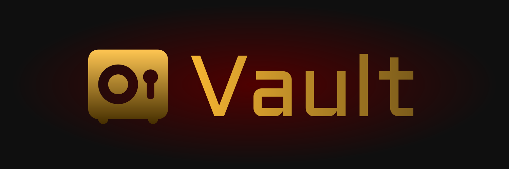
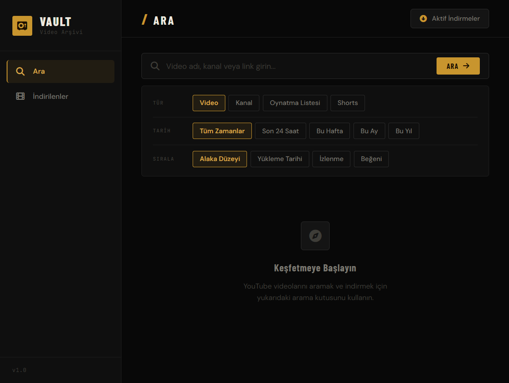
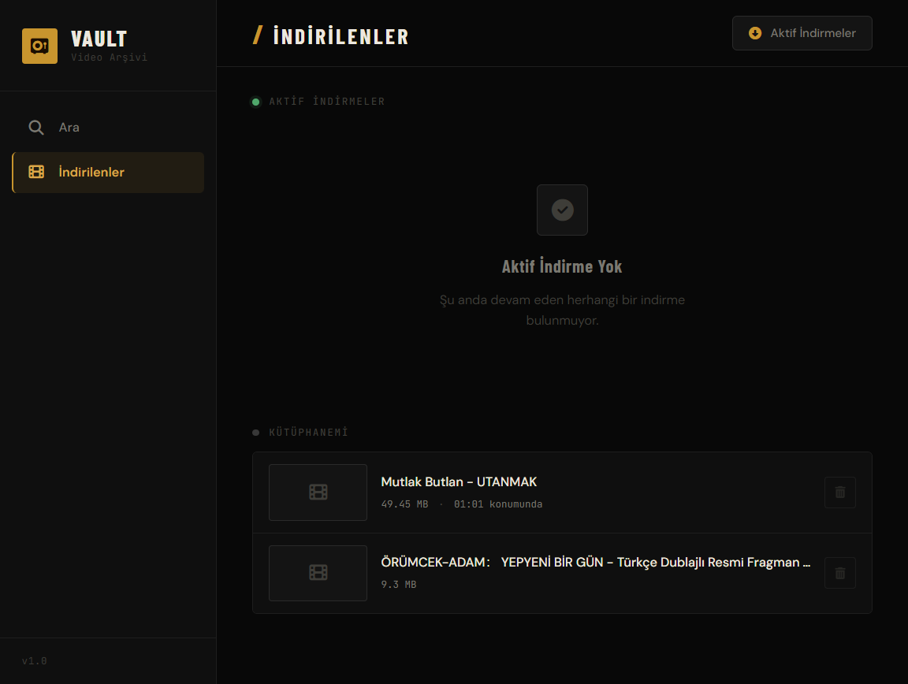

<h1 align="center">🔒 Vault</h1>

**Vault**, YouTube videolarını arayıp indirmenize ve indirdiğiniz videoları yerleşik oynatıcıyla izlemenize olanak tanıyan açık kaynaklı, çok platformlu bir uygulamadır. **FastAPI** arka ucu, **Plyr.io** video oynatıcısı ve **Flet** mobil sarmalayıcısı ile Python üzerine inşa edilmiştir. WebAssembly üzerinde çalışan FFmpeg sayesinde video birleştirme işlemini cihazınızda yerel olarak gerçekleştirir.

[](https://python.org)
[](https://fastapi.tiangolo.com)
[](https://flet.dev)
[](https://github.com/yt-dlp/yt-dlp)
[](https://plyr.io)
[](https://wasmtime.dev)
[](https://github.com/yaso09/vault/releases)
[](https://www.gnu.org/licenses/gpl-3.0.html)
[](https://github.com/yaso09/vault/releases)

<p align="center">
  
  
</p>

---

## 🚀 Özellikler

- 🔍 **Gelişmiş Arama** — YouTube'da video, kanal, oynatma listesi ve Shorts araması; tür, tarih ve sıralama filtreleri
- ⬇️ **yt-dlp Tabanlı İndirme Motoru** — 2 aşamalı indirme (video + ses ayrı ayrı), gerçek zamanlı ilerleme çubuğu, hız ve kalan süre göstergesi, otomatik yeniden deneme (10 deneme)
- 🎞️ **WebAssembly FFmpeg ile Video Birleştirme** — İndirilen video ve ses parçalarını `wasmtime` üzerinde FFmpeg-WASI çalıştırarak tek MP4 dosyasında birleştirir; yeniden kodlama yapmaz (`-c:v copy`), ses AAC'e dönüştürülür, `faststart` ile web uyumlu hale getirilir
- 🎬 **Plyr.io Yerleşik Video Oynatıcı** — Oynatma/duraklatma, arayıp tarama, ses kontrolü, oynatma hızı (0.25×–2×), tam ekran, resim içinde resim (PiP), altyazı desteği, 10 saniye ileri/geri
- 💾 **Oynatma Konumu Kaydetme** — İzleme sırasında konum 2 saniyede bir otomatik kaydedilir; tekrar açıldığında kaldığınız yerden devam eder
- 📚 **Video Kütüphanesi** — İndirilen videoların listesi, dosya boyutu, oynatma konumu çubuğu, tek tıkla oynat veya sil
- 📺 **Kanal Sayfası** — Kanal başlığı, banner, avatar, abone sayısı, doğrulama rozeti, açıklama ve video listesi (En Yeni / En Popüler sıralama)
- 📋 **Oynatma Listesi Desteği** — Oynatma listelerini arama, video sayısı ve yükleyici bilgilerini görüntüleme, toplu indirme
- 📱 **Çok Platformlu** — Mobil görünüm için Flet WebView sarmalayıcı; Android APK, iOS IPA, Windows, macOS, Linux derleme
- 🎨 **Endüstriyel Koyu Tema** — Amber vurgulu karanlık tasarım, duyarlı (responsive) düzen (masaüstü yan çubuk / mobil alt gezinme)

---

## 🧱 Mimari

```
┌─────────────────────────────────────────────────────────┐
│                    Tarayıcı / WebView                    │
│  ┌──────────┐  ┌──────────┐  ┌──────────────────────┐   │
│  │ search   │  │ library  │  │  Plyr.io Video       │   │
│  │ page     │  │ page     │  │  Player (overlay)     │   │
│  ├──────────┤  ├──────────┤  ├──────────────────────┤   │
│  │ filters  │  │downloads │  │  position save/      │   │
│  │ pills    │  │ list     │  │  restore             │   │
│  └──────────┘  └──────────┘  └──────────────────────┘   │
│  ┌──────────────────────────────────────────────────┐   │
│  │          Channel overlay modal                   │   │
│  └──────────────────────────────────────────────────┘   │
└──────────────────────┬──────────────────────────────────┘
                       │ REST API (JSON)
┌──────────────────────▼──────────────────────────────────┐
│              FastAPI + Uvicorn (localhost:8000)           │
│                                                          │
│  /api/search      → YouTube arama                       │
│  /api/channel     → Kanal bilgileri                     │
│  /api/download    → İndirme başlatma                    │
│  /api/downloads   → Aktif indirme durumu                │
│  /api/library     → İndirilen videolar                  │
│  /api/library/position → Oynatma konumu                 │
│  /video/{filename} → Video akışı (range request)        │
└──────┬───────────────────────┬──────────────────────────┘
       │                       │
┌──────▼──────────┐   ┌───────▼──────────────────────────┐
│  yt-dlp         │   │  wasmtime + FFmpeg-WASI          │
│  · video indir  │   │  · video+ses birleştirme         │
│  · ses indir    │   │  · AAC kodlama + faststart       │
│  · meta bilgi   │   │  · Android _libwasmtime.so       │
└─────────────────┘   └──────────────────────────────────┘
```

### Mimaride Önemli Noktalar

- **Çalışma Zamanı:** Flet arayüzü kullanılmaz; sunucu FastAPI ile çalışır, ön yüz statik HTML/CSS/JS dosyalarından oluşur. Flet yalnızca `--mobile` modunda WebView sarmalayıcı ve `flet build` derleme komutları için kullanılır.
- **İndirme Süreci:** 1. Video akışı (%0–45) → 2. Ses akışı (%45–90) → 3. WASM FFmpeg ile birleştirme (%90–100) → 4. Geçici dosyaların temizlenmesi
- **Video Oynatma:** Plyr.io kütüphanesi ile HTTP Range Request desteği sayesinde arayıp tarama (seek) sorunsuz çalışır
- **Oynatma Konumu:** `~/.vault/videos/.playback_positions.json` dosyasında JSON formatında saklanır

---

## 📁 Proje Yapısı

```
vault/
├── main.py                    # Giriş noktası — typer CLI, otomatik port seçimi
│
├── utils/
│   ├── cli.py                 # Typer CLI — run, download, search, info komutları
│   ├── search_engine.py       # YouTube arama motoru — yt-dlp, SP filtre kodları, sonuç işleme
│   ├── downloader.py          # İndirme yöneticisi — 2 aşamalı indirme, ilerleme takibi, FFmpeg çağrısı
│   ├── ffmpeg.py              # WebAssembly FFmpeg sarmalayıcı — wasmtime ile WASM yürütme
│   └── server.py              # Bağımsız FastAPI sunucu modülü — ffmpeg.wasm dosya sunumu (+COOP/COEP)
│
├── static/
│   ├── index.html             # Tek sayfa uygulama (SPA) — arama, kütüphane, oynatıcı, kanal modalı
│   ├── style.css              # Endüstriyel koyu tema (1200+ satır) — Plyr özelleştirmesi, responsive
│   ├── app.js                 # Ön yüz mantığı — Plyr kurulumu, API çağrıları, durum yönetimi (660 satır)
│   ├── plyr.css               # Plyr.io v3.7.8 stilleri (lokal)
│   ├── plyr.min.js            # Plyr.io v3.7.8 kütüphanesi (lokal)
│   └── plyr.svg               # Plyr.io ikon spritemap (lokal)
│
├── libs/
│   └── wasmtime/              # wasmtime-py v45 bağlantıları (Android uyumluluğu için lokal kopya)
│       ├── android-aarch64/   # Android ARM64 için derlenmiş _libwasmtime.so
│       └── ...
│
├── assets/
│   ├── banner.svg / .png      # README başlık banner'ı
│   ├── icon.png               # Uygulama simgesi
│   ├── vault.svg              # Logo
│   ├── screen-shot-1.png      # Uygulama ekran görüntüsü
│   ├── screen-shot-2.png      # Uygulama ekran görüntüsü
│   └── wasmtime_libs/
│       └── _libwasmtime.so    # Wasmtime yerel kütüphanesi (Android)
│
├── binaries/                  # FFmpeg WASM çıktıları (build-ffmpeg.sh ile oluşturulur)
│   ├── ffmpeg.wasm
│   └── ffprobe.wasm
│
├── FFmpeg-WASI/               # Git alt modülü — WASM FFmpeg kaynağı
│
├── public/                    # ffmpeg.wasm dosyaları (server.py endpoint'i için)
│
├── pyproject.toml             # Proje yapılandırması — bağımlılıklar, Flet derleme ayarları
├── requirements.txt           # Derlenmiş bağımlılıklar (uv tarafından otomatik oluşturulur)
├── uv.lock                    # uv kilit dosyası
├── .python-version            # Python 3.11
├── build-ffmpeg.sh            # FFmpeg-WASI alt modülü derleme betiği
├── CHANGELOG.md               # Sürüm notları
├── LICENSE                    # GNU GPL v3.0
└── README.md                  # Bu dosya
```

---

## 🔧 API Referansı

| Yöntem | Uç Nokta | Açıklama |
|--------|----------|----------|
| `GET` | `/` | Ana sayfa — `index.html` + `app.js` enjeksiyonu |
| `GET` | `/api/search?q=&type=&date=&sort=` | YouTube araması (video/kanal/playlist/shorts) |
| `GET` | `/api/channel?url=&sort_by=` | Kanal bilgisi ve video listesi (latest/popular) |
| `GET` | `/api/downloads` | Tüm indirme durumları (aktif + bitmiş) |
| `POST` | `/api/download` | `{url, title}` ile indirme başlatma |
| `GET` | `/api/library` | İndirilen video dosyalarının listesi |
| `DELETE` | `/api/library/{filename}` | Video dosyası silme |
| `POST` | `/api/library/position` | `{filepath, position_ms}` oynatma konumu kaydetme |
| `GET` | `/api/library/positions` | Tüm kayıtlı oynatma konumları |
| `GET` | `/video/{filename}` | Video akışı (HTTP Range Request, 206 Partial Content) |

---

## 💻 Geliştirici Bilgileri

### Bağımlılıklar

| Paket | Sürüm | Kullanım |
|-------|-------|----------|
| `fastapi` | ≥0.136 | REST API çatısı |
| `uvicorn` | ≥0.49 | ASGI sunucusu |
| `yt-dlp` | ≥2026.3.17 | YouTube indirme ve arama |
| `wasmtime` | ≥45.0.0 | WebAssembly FFmpeg çalıştırma |
| `flet` | ≥0.85.2 | Mobil WebView sarmalayıcı ve derleme |
| `flet-webview` | ≥0.85.2 | Flet WebView bileşeni |
| `pydantic` | ≥2.13 | Veri doğrulama |

### Arama Filtre Kodları (SP)

`search_engine.py` içinde YouTube'un `sp` parametresi için 30+ filtre kombinasyonu tanımlıdır:

- **Tür:** video, channel, playlist, shorts
- **Tarih:** any, today, week, month, year
- **Sıralama:** relevance, date, views, likes

### İndirme Format Seçimi

```
Video: bestvideo[height≤1080][vcodec^=avc1] → H.264 öncelikli
Ses:   bestaudio[ext=m4a]/bestaudio
```

### Platform Algılama

Android ortamı `ANDROID_ROOT`, `TERMUX_VERSION`, `/system/build.prop` varlığına göre otomatik algılanır. Android'de `libs/` dizini `sys.path`'e eklenir.

### Port Yönetimi

Varsayılan port 8000'dir. Eğer meşgulse otomatik olarak bir üst port denenir.

---

## ⚙️ Gelişmiş Kullanım

### Otomatik Platform Algılama

Argümansız çalıştırıldığında platform otomatik algılanır:
```bash
uv run main.py                  # Android'de --mobile, diğerlerinde --desktop
```

### Flet Mobil WebView

```bash
uv run main.py --mobile         # 440×840 mobil pencere, Flet WebView ile
```

Android/iOS'te `flet-webview` yoksa otomatik olarak `--web` moduna düşer.

### FFmpeg WASM'yi Yeniden Derleme

```bash
chmod +x build-ffmpeg.sh
./build-ffmpeg.sh               # FFmpeg-WASI alt modülünü günceller ve binaries/ klasörüne kopyalar
```

---

## 💻 CLI Kullanımı

Vault, komut satırından tam kontrol için `typer` tabanlı bir CLI sunar.

### Global Seçenekler

| Bayrak | Varsayılan | Açıklama |
|--------|-----------|----------|
| `-p, --port` | 8000 | Sunucu portu |
| `--verbose` | — | Detaylı log çıktısı |

### Komutlar

```bash
python main.py run --desktop          # Sunucu + tarayıcı
python main.py run --web              # Sadece sunucu
python main.py run --mobile           # Sunucu + Flet WebView
python main.py download <URL>         # Video indir
python main.py search <sorgu>         # YouTube'da ara
python main.py info <URL>             # Video bilgisi göster
```

Detaylı kullanım: [`docs/cli.md`](docs/cli.md)

---

## 📜 Lisans

Bu proje **[GNU General Public License v3.0](https://www.gnu.org/licenses/gpl-3.0.html)** lisansı altındadır.

```
Vault - Video Archive App
Copyright (C) 2026  Yasir Eymen

This program is free software: you can redistribute it and/or modify
it under the terms of the GNU General Public License as published by
the Free Software Foundation, either version 3 of the License.
```

Tam metin: [`LICENSE`](LICENSE)
